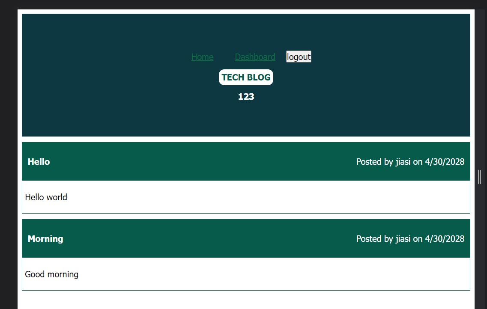

# 14 Model-View-Controller (MVC): Tech Blog

## Description

I build a CMS-style blog site, where developers can publish their blog posts and comment on other developers’ posts as well. In addition, it can create a new blog and new comments, and also delete a post that we do not need. This application follows the MVC paradigm in its architectural structure, using Handlebars.js, Sequelize as the ORM, and the express-session npm package for authentication.

## Screenshot

## Link
The link of the repo: https://github.com/Jiasisi/Tech-Blog-MVC

